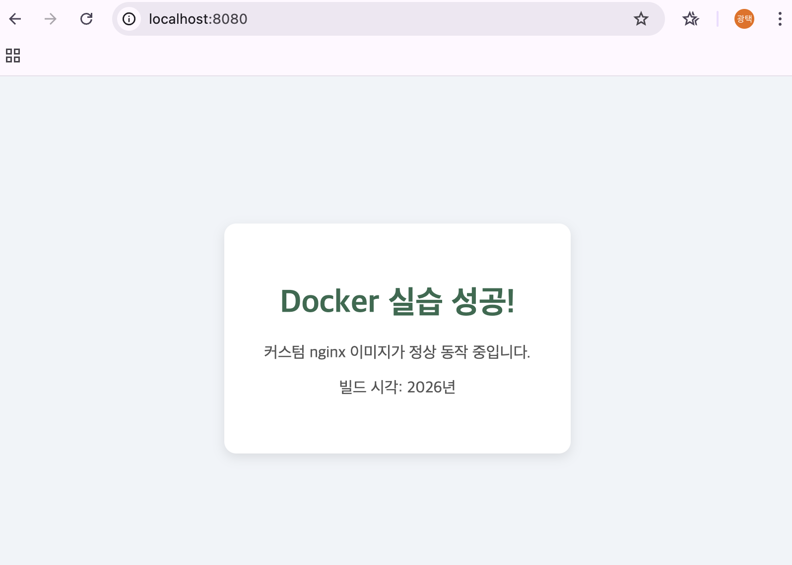
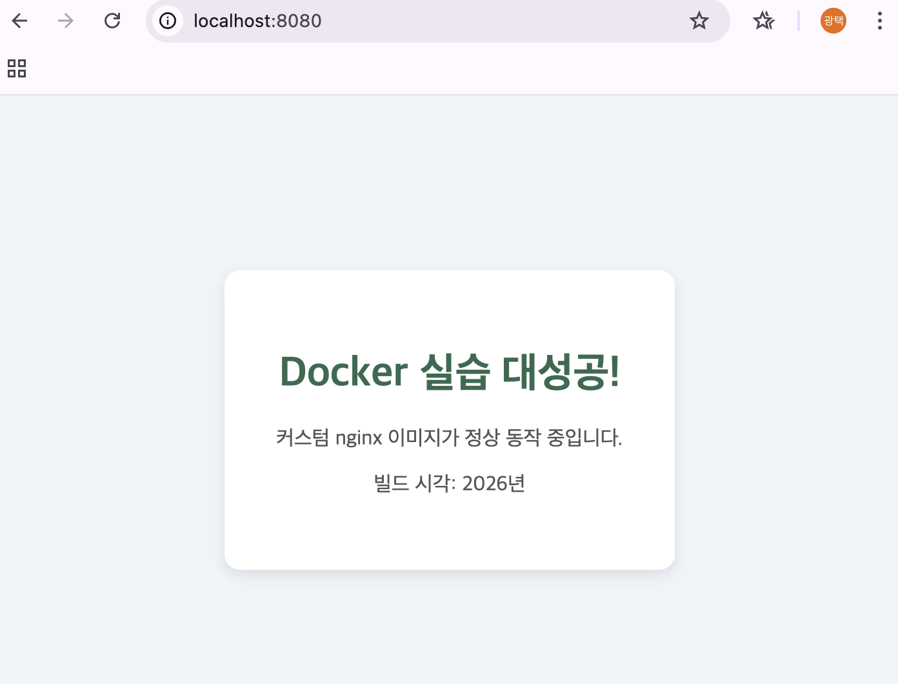

# 미션1: 개발 워크스테이션 구축

## 1. 프로젝트 개요
개발 환경(터미널, Docker, Git)을 직접 세팅한다.

---

## 2. 실행 환경
| 항목 | 내용 |
|------|------|
| OS | macOS 15.7.7 |
| Shell | /bin/zsh |
| Docker | 28.5.2 (OrbStack) |
| Git | 2.53.0 |

---

## 3. 수행 항목 체크리스트
- [ ] 터미널 기본 조작 연습
- [ ] 파일 권한 변경 실습
- [ ] Docker 기본 명령어
- [ ] 간단한 웹서버 컨테이너 띄우기
- [ ] ubuntu 컨테이너 내부 진입 실습
- [ ] Dockerfile 커스텀 이미지 빌드
- [ ] 포트 매핑 접속 검증
- [ ] 바인드 마운트 반영 확인
- [ ] Docker 볼륨 영속성 검증
- [ ] Git 설정 + GitHub 연동

---

## 4. 검증 방법 및 결과

### 4-1. 터미널 조작
[로그보기](./Log_4-1.터미널.md)

### 4-2. Docker 운영/검증
[로그보기](./Log_4-2.Docker.md)

### 4-3. Doeckfile 기반 웹서버 컨테이너
[로그보기](./Log_4-3.Dockerfile.md)

### 4-4. 포트매핑 접속
[로그보기](./Log_4-4.포트매핑.md)


### 4-5. 바인드 마운트
[로그보기](./Log_4-5.바인드마운트.md)


### 4-6. 볼륨 연속성
[로그보기](./Log_4-6.볼륨영속성.md)

### 4-7. Git 설정 및 GitHub/VSCode 연동
[로그보기](./Log_4-7.Git.md)

---

## 5. 트러블슈팅 (문제 → 원인 가설 → 확인 → 해결/대안)

### CASE 1. 포트 충돌
**문제**
```
docker run -p 8080:80 실행 시 아래 에러 발생
```

**원인가설**

8080 포트를 이미 다른 컨테이너(또는 프로세스)가 점유하고 있을 것이다.


**확인**
```docker ps // 실행 중인 컨테이너 포트 확인
lsof -i:8080 // 사용자 소유의 프로세스만 확인
```

**해결/대안**

방법 1: 기존 컨테이너 중지 후 재실행
```
docker stop nginx1
docker run -d -p 8080:80 --name nginx2 nginx:latest
```

방법 2: 다른 포트 사용
```
docker run -d -p 8081:80 --name nginx2 nginx:latest
```

### CASE 2. 컨테이너 있는 상태에서 이미지 삭제
**문제**
```
docker rmi nginx (또는 이미지 ID) 실행 시 아래 에러 발생하며 이미지 삭제 실패
```

**원인가설**

컨테이너가 종료(stop) 상태이더라도 삭제(rm)되지 않고 남아있다면, 해당 컨테이너가 원본 이미지를 여전히 참조하고 있으므로 이미지를 지울 수 없을 것이다.

**확인**
```
docker ps -a | grep nginx   # 정지된 상태를 포함한 모든 nginx 컨테이너 확인
```

**해결/대안**

방법 1: 정지된 컨테이너 삭제 후 이미지 삭제
```
docker rm [컨테이너_ID_또는_이름]  # 이미지를 붙잡고 있는 정지된 컨테이너 제거
docker rmi nginx                # 원본 nginx 이미지 삭제
```
---
